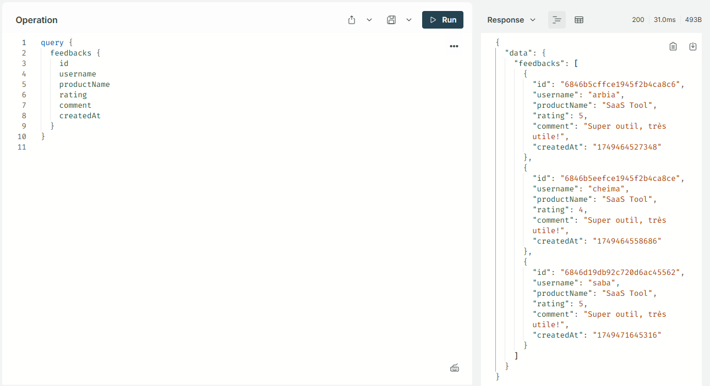
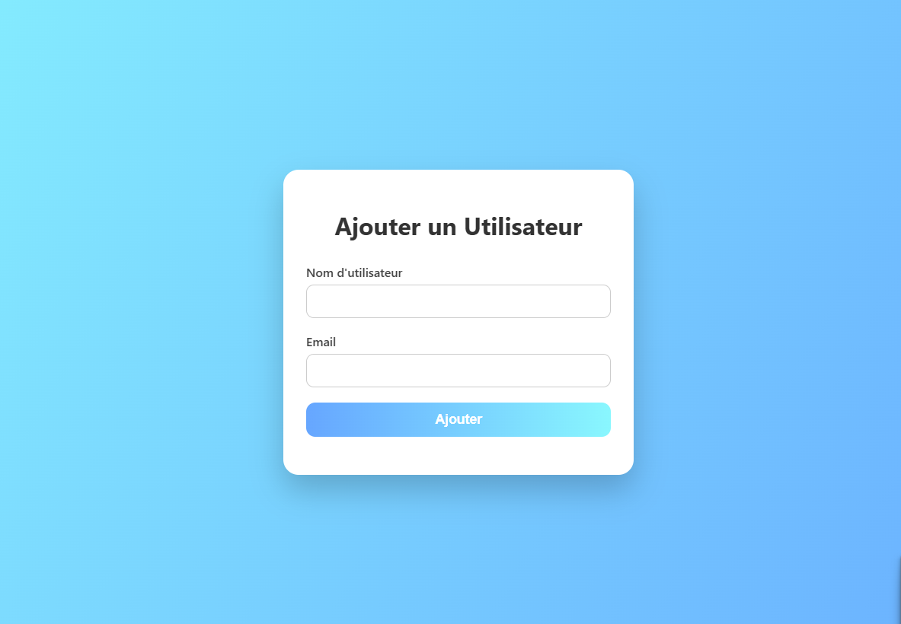

# 🛠️ Web Service GraphQL - Feedback App

## 1. ✅ Solution proposée

### 🔍 Analyse du problème
L’objectif est de développer un web service permettant :
- La gestion d’utilisateurs
- L’ajout de produits
- La collecte de feedbacks liés aux produits

## 🖼️ Screenshots

### 🔍 GraphQL Playground


### ➕ Add User Interface


### 💬 Submit Feedback Interface


### 👁️ View Feedbacks


### 📦 Identification des entités & relations

#### Entités :
- **User** : username, email
- **Product** : name, description, version
- **Feedback** : username, productName, rating, comment

#### Relations :
- Un utilisateur peut envoyer plusieurs feedbacks
- Un produit peut avoir plusieurs feedbacks
- Chaque feedback est lié à un utilisateur et un produit

### 🧩 Liste des fonctionnalités (sous forme de web service GraphQL)
- Ajouter un utilisateur
- Ajouter un produit
- Ajouter un feedback
- Récupérer la liste des utilisateurs
- Récupérer la liste des produits
- Récupérer les feedbacks
- Filtrer les feedbacks par produit

---

## 2. 📊 Diagrammes

### 📘 Diagramme de classes / Entités

```
User
 └─ username: String
 └─ email: String

Product
 └─ name: String
 └─ description: String
 └─ version: String

Feedback
 └─ username: String (relation vers User)
 └─ productName: String (relation vers Product)
 └─ rating: Int
 └─ comment: String
```

### 🔁 Schéma des requêtes & réponses (GraphQL)

#### Exemple Mutation :
```graphql
mutation {
  createUser(username: "amine", email: "amine@example.com") {
    id
    username
    email
  }
}
```

#### Exemple Query :
```graphql
{
  feedbacksByProduct(productName: "AppX") {
    username
    rating
    comment
  }
}
```

---

## 3. ⚙️ Implémentation technique

- **Technologie utilisée** : GraphQL (via Apollo Server Express)
- **Base de données** : MongoDB (via Mongoose)
- **Backend** : Node.js / Express.js
- **Organisation** :
  - `/models` : Schémas Mongoose
  - `/resolvers.js` : Résolveurs GraphQL
  - `/schema.js` : Schéma GraphQL
  - `/server.js` : Lancement du serveur

---

## 4. 📚 Documentation

### 🔍 Description du schéma GraphQL

#### Mutations :
```graphql
createUser(username: String!, email: String!): User
createProduct(name: String!, description: String!, version: String!): Product
createFeedback(username: String!, productName: String!, rating: Int!, comment: String): Feedback
```

#### Queries :
```graphql
users: [User]
products: [Product]
feedbacks: [Feedback]
feedbacksByProduct(productName: String!): [Feedback]
```

---

### 📌 Exemples d'utilisation

#### ➕ Ajouter un produit
```graphql
mutation {
  createProduct(name: "AppX", description: "Application de test", version: "1.0") {
    name
    version
  }
}
```

#### 🔍 Voir tous les feedbacks
```graphql
{
  feedbacks {
    username
    productName
    rating
    comment
  }
}
```

---

### 💡 Remarque

Les **mutations** et **requêtes GraphQL** peuvent être testées de deux façons :  
- Directement via l'**interface GraphiQL** (souvent disponible sur `http://localhost:4000/graphql`)  
- Ou via un **frontend simple** (ex. : formulaire HTML + fetch JavaScript)  
👉 Cela permet de **faciliter les tests** et **éviter d'écrire manuellement** des mutations complètes à chaque fois.
